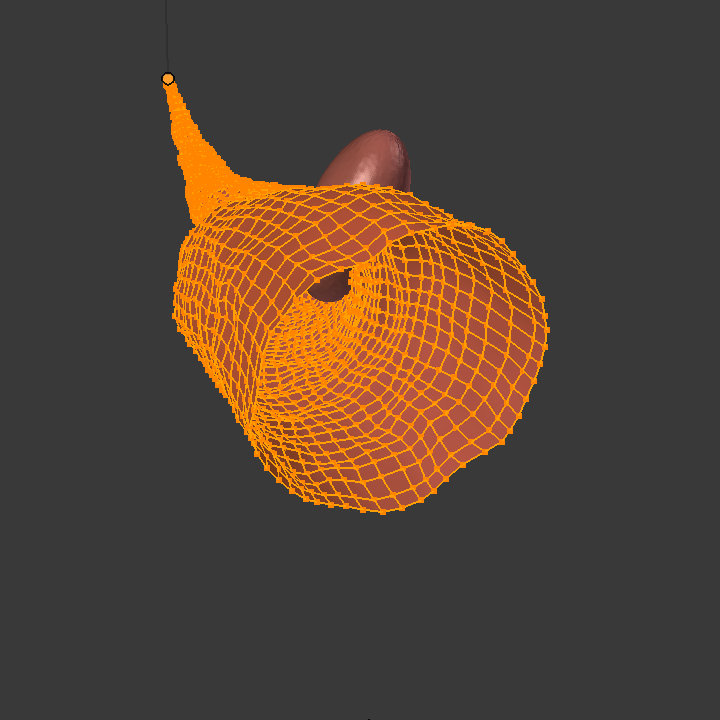

# Synthetic data for unsupervised polyp segmentation

**UPDATE** 

We release [CUT-seg](https://github.com/enric1994/cut-seg), a new model that is computationally less expensive, and requires less real images than CycleGAN. It is composed by a segmentation model and a generative model that are jointly trained to produce realistic images while learning to segment polyps. We take advantage of recent one-sided translation models because they use significantly less memory, allowing us to add a segmentation model in the training loop.

 

  
   
  
  

Source code used in the paper and generation of the [Synth-Colon dataset](https://enric1994.github.io/synth-colon/).

## Abstract
Deep learning has shown excellent performance in analysing medical images. However, datasets are hard to obtain due privacy issues, standardization problems, and lack of annotations. We address these problems by producing realistic synthetic images using a combination of 3D technologies and generative adversarial networks. We use zero annotations from medical professionals in our pipeline.
Our fully unsupervised method achieves promising results on five real polyp segmentation datasets.
As a part of this study we release Synth-Colon, an entirely synthetic dataset that includes 20.000 realistic colon images and additional details about depth and 3D geometry.

# Setup
* In order to run our code Docker, Docker-Compose and NVIDIA-Docker are required. 

* hardnet68.pth pre-trained weights for HarDNet68 can be found [here](https://github.com/PingoLH/Pytorch-HarDNet). Change the weight path in lib/hardnet_68.py line 203 for loading the pretrain_weight

* Required datasets can be found here: [train](https://drive.google.com/file/d/1lODorfB33jbd-im-qrtUgWnZXxB94F55/view?usp=sharing), [test](https://drive.google.com/file/d/1o8OfBvYE6K-EpDyvzsmMPndnUMwb540R/view?usp=sharing). Edit `docker/docker-compose.yml` with the location of your data. It should have the following structure: `polyp-data/{TrainDataset, TestDataset}`

## 1. Starting the containers
First, run `docker-compose up -d` in the `docker/` folder. It will start 3 containers with all the dependencies installed. This step can take up to 3 hours.

## 2. Synthetic images and annotations generation with Blender
In order to generate the dataset run: `docker exec synth-polyp python ./synth/src/generate.py --name synth_polyp_V15 --size 8000`

## 3. Produce realistic images with CycleGAN
* Prepare data for CycleGAN(20 Kvasir images and 200 synthetc images): `docker exec cyclegan python /cyclegan/cyclegan/prepare_cyclegan.py --name synth_polyp_V15 --synth-dataset /cyclegan/data/synth_polyp_V15 --real-dataset /polyp-data/TestDataset/Kvasir/images --train-size-real 20 --train-size-synth 400 --test-size 5`

* Train CycleGAN for 200 epochs: `docker exec cyclegan python /cyclegan/cyclegan/train.py --dataroot /cyclegan/data/synth_polyp_V15/ --name synth_polyp_V15 --model cycle_gan --checkpoints_dir /cyclegan/data/synth_polyp_V15/checkpoints`. It can day up to 12 hours.

* Infer 200 images synthetic to CycleGAN: `docker exec cyclegan python /cyclegan/cyclegan/test.py --dataroot /cyclegan/data/synth_polyp_V15/ --checkpoints_dir /cyclegan/data/synth_polyp_V15/checkpoints --name synth_polyp_V15 --model cycle_gan --phase train --epoch 200`

## 4. Train polyp segmentation using synthetic data

* `docker exec -it main python /main/Train.py --train_path  --test_path /polyp-data/TestDataset/Kvasir --train_save synth_polyp_V15 | tee logs/synth_polyp_V15.log`

## 5. Evaluation
* Generate the masks for the test set: `docker exec -it main python /main/Test.py --pth_path /main/data/synth_polyp_V15/snapshots/HarD-MSEG-best.pth --test_data /polyp-data/TestDataset --save_path /main/data/synth_polyp_V15/results`

* To obtain all the metrics (iou, mae, spe) run this Matlab script using Octave: `cd eval`; `octave`; `pkg install -forge image`; `pkg load image`; `main`. It can take up to two hours.

* The results are in `eval/EvaluateResults`

# References
* https://github.com/james128333/HarDNet-MSEG
* https://github.com/DengPingFan/PraNet
* https://github.com/junyanz/pytorch-CycleGAN-and-pix2pix